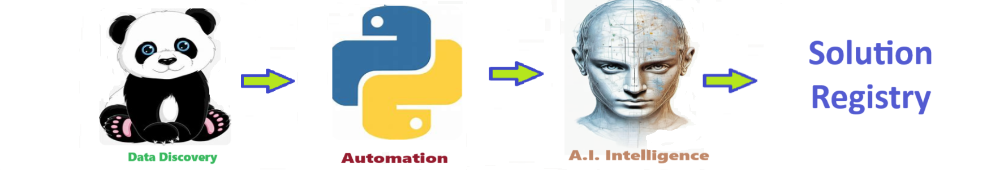

# Solution Registry  - Solution Registry - houses a list of solutions
Solution Registry - houses a list of solutions

Welcome to the solution **Solution Registry ** - an example for your projects

Solution Registry - houses a list of solutions

## Features
- Easy to understand and use  
- Easily Configurable 
- Quickly start your project with pre-built templates
- Its Fast and Automated

## Notebook Features
- **Self Documenting** - Automatically identifes major steps in notebook 
- **Self Testing** - Unit Testing for each ptyhon function
- **Easily Configurable** -easily modifyable with config.INI name value pairs
- **Includes Talking Code** - The code explains itself.
- **Self Logging** - enhanced python standard logging   
- **Self Debugging** - enhanced python standard debugging
- **Low Code - or - No Code** - Most solutions are under 50 lines of code
- **Educational** - Includes educational dialogue and background material
    
## Getting Started
To get started with the **Solution Registry ** solution repository, follow these steps:
1. Clone the repository to your local machine.
2. Install the required dependencies listed at the top of the notebook.
3. Explore the example code provided in the repository and experiment.
4. Run the notebook and make it your own - **EASY !**
    
## https://github.com/JoeEberle/ -- josepheberle@outlook.com 
    

          